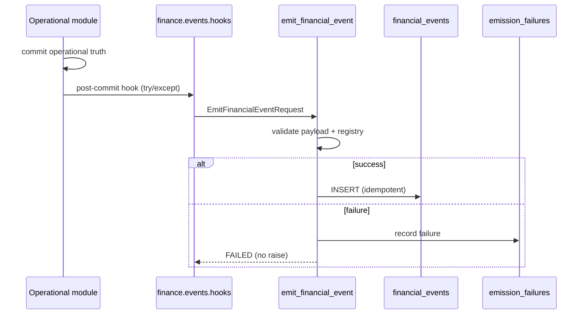

# Finance E3 — Financial Event Infrastructure

Immutable **economic lineage** only. Not accounting, not GL, not `commercial_transactions`.

## Schema (`financial_events`)

| Column | Purpose |
|--------|---------|
| `id` | Event identity |
| `company_id`, `branch_id` | Tenancy + branch scope |
| `operational_domain` | wholesale, procurement, hospital, operations |
| `event_type` | Registry key (e.g. `receivable_accrued`) |
| `classification` | Governance classification at emission |
| `event_schema_version` | Payload schema evolution |
| `occurred_at` | **Business/economic time** |
| `emitted_at` | **System persistence time** |
| `amount`, `currency_code`, `economic_direction` | Canonical measurable semantics |
| `source_entity_type`, `source_entity_id`, `source_reference` | Operational linkage |
| `idempotency_key` | Unique per company |
| `reversal_of_event_id` | Compensating lineage |
| `caused_by_event_id` | Reserved causation graph (future) |
| `payload_json` | Lineage context only |
| `governance_metadata_json` | Emitter/registry metadata |

`financial_event_emission_failures` — repair queue for failed emits (replay visibility, not async workers).

## Payload philosophy

**Allowed:** amounts, currency, document numbers, entity IDs, method, status flags, lightweight context.

**Forbidden:** `invoice`, `lines`, `items`, `customer` objects, full operational clones.

Enforced by `validate_event_payload()` in `app/finance/events/payload.py`.

## Event registry

`app/finance/events/registry.py` — `FINANCIAL_EVENT_REGISTRY` (canonical event metadata).

Introspection: `GET /api/finance/events/registry` (requires `finance.reports.audit_read`).

## Emission flow

## Idempotency

Template per event type, e.g. `sales_invoice:{id}:receivable_accrued`.

Unique constraint: `(company_id, idempotency_key)`.

Duplicate emit → `EmitResult.DUPLICATE` (no second row).

## Reversal semantics

Original event types marked `reversibility=True` with `compensating_event_type`.

Use `emit_reversal_event()` — sets `reversal_of_event_id`, never UPDATE.

## Initial emitters (post-commit, non-blocking)

| Hook | Event |
|------|-------|
| Sales invoice batch | `receivable_accrued` (if customer balance > 0) |
| Customer payment | `cash_received` |
| Supplier invoice batch | `payable_recognized` |
| Supplier payment | `cash_paid` |
| Insurance settlement | `insurance_settlement_received` |
| Expense approved (create/approve) | `expense_recognized` |

## Governance integration

- Classification from event registry (domain-derived).
- Read API: `FinanceAccessContext` + `guard_finance_report_access` + branch filters.
- Emission logging: `pharmasight.finance.events` JSON lines + failure table.

## Read API

- `GET /api/finance/events` — list (management + branch scope)
- `GET /api/finance/events/{id}` — lineage (reversals, caused_by)
- `GET /api/finance/events/registry` — catalog

## Unresolved accounting boundaries (future)

- No debit/credit, `account_id`, journal posting.
- No TB/BS, period close, retained earnings.
- `caused_by_event_id` graph orchestration deferred.
- No async replay workers (failures table is manual/SRE for now).
- `commercial_transactions` remains separate fiscal spine.

## Migration

Apply `137_financial_events.sql` on app startup.
