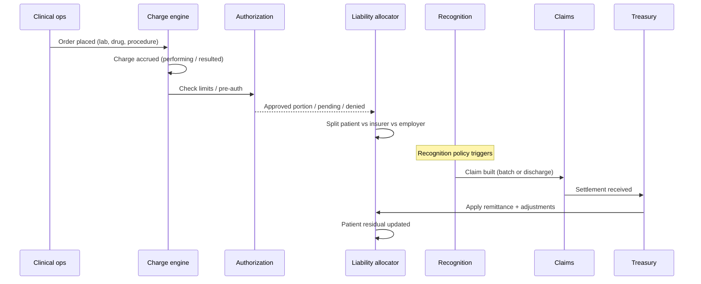

# Hospital Economic Topology — Architectural Analysis

**Status:** Design doctrine (pre-implementation)  
**Scope:** Operational-economic architecture for healthcare finance — not billing screens, not GL posting.  
**Tenancy:** Single shared Postgres DB; all entities scoped by `company_id` (and `branch_id` where applicable).

---

## Executive thesis

PharmaSight currently runs three **economic regimes** that must not share the same constitutional object:

| Regime | Liquidity model | Primary economic clock | Settlement shape |
|--------|-----------------|------------------------|------------------|
| **Retail** | Immediate | Point of sale | Cash ↔ revenue in one beat |
| **Wholesale** | Deferred | Invoice issuance | AR accrual → payment allocation |
| **Hospital** | Longitudinal, multi-party | Care delivery | Accrued care → split liability → authorization → recognition → collection → residual |

**Hospital is not “another sales workflow.”** Collapsing it into `sales_invoices` + `insurance_claims` anchored on a single invoice (as OPD does today) is a **retail projection** onto care. It works for same-day OPD self-pay; it fails for IPD, split payers, pre-auth, capitation, and discharge settlement.

The constitutional object is the **Patient Financial Journey (PFJ)** — a longitudinal container — with **Care Episodes** and **Encounters** as clinical-economic scopes, and **Charges** as the atomic unit of accrued value.

---

## 1. Constitutional economic objects

### 1.1 Object hierarchy (recommended)

```
Patient (identity)
 └── Patient Financial Journey (PFJ)          ← constitutional economic root
      ├── Coverage Profile (insurer / employer / self-pay rules)
      ├── Care Episode (condition / admission arc)
      │    ├── Encounter (visit / attendance unit)     ← OPD, ED, day-case
      │    │    └── Charge Lines (accrued care value)
      │    └── Admission (IPD container)               ← bed days, DRG, packages
      │         └── Encounters & departmental charges
      ├── Authorization (pre-auth / limits / conditions)
      ├── Liability Allocation (who owes what, when)
      ├── Claim (payer submission unit)
      ├── Settlement Batch (payer remittance)
      └── Patient Residual (copay, deductible, denied portions)
```

### 1.2 What each object is *for* (not what it is named in UI)

| Object | Role in topology | Authoritative for |
|--------|------------------|-------------------|
| **Patient** | Identity & demographics | Clinical identity only — not economics |
| **Patient Financial Journey (PFJ)** | Longitudinal economic container for all open financial obligation tied to a patient (or episode group) at a facility | Running exposure, payer mix, authorization state, settlement pipeline |
| **Care Episode** | Clinical-economic arc (e.g. “pneumonia admission Jan–Feb”, “antenatal package”) | Grouping charges, authorizations, and discharge rules |
| **Encounter** | Atomic attendance / service session (OPD visit, ED presentation, ward round) | Operational workflow, charge capture timing, clinical correlation |
| **Admission** | IPD-specific episode extension (bed, LOS, packages) | Inpatient accrual rhythm, interim vs final billing |
| **Charge** (charge line / service instance) | **Smallest unit of accrued care value** — consultation, lab panel, drug dispense, procedure, bed day | Quantity, tariff, performing dept, clinical order link |
| **Authorization** | Conditional permission to accrue or recognize against a payer | Covered amount, validity window, exclusions — **not** cash |
| **Liability Allocation** | Definitive or provisional split: patient / insurer / employer | Who is obligated for which portion of which charges |
| **Claim** | Formal demand on a third-party payer | Billed amount, line bundling, submission lifecycle |
| **Invoice / Statement** | **Presentation & legal demand artifact** — subset of PFJ at a point in time | Printable/exportable demand; may lag accrual by days |
| **Settlement** | Payer remittance application | Treasury realization against insurer AR |

### 1.3 What is *not* constitutional

- **`sales_invoice`** — Retail/wholesale liquidity instrument. In hospital, it is a **downstream export** (statement slice), not the economic root.
- **`insurance_claim` anchored 1:1 on `sales_invoice_id`** (current schema) — Treats claim as invoice shadow; cannot represent multi-encounter IPD, split lines, or partial approvals per charge.
- **Draft invoice per encounter** (`clinic_billing_service.ensure_draft_invoice_for_encounter`) — Acceptable **bridge** for OPD; must not become the PFJ model.

### 1.4 Recommended primary key for correlation

All hospital financial events should correlate to:

`correlation_group_id = PFJ.id` (or `care_episode_id` for episode-scoped sub-ledgers)

Encounters and admissions are **scopes**, not settlement roots.

---

## 2. Progressive accumulation of economic value during care

Care value accrues **continuously and asynchronously** across departments. Recognition and collection lag accrual.

### 2.1 Accrual timeline (typical IPD + insured)



### 2.2 Value states by care type

| Stage | Consultation | Lab / imaging | Pharmacy | Procedure | Admission | Discharge |
|-------|--------------|---------------|----------|-----------|-----------|-----------|
| **Ordered** | Optional fee hold | Expected | Rx written | Scheduled | Bed reserved | — |
| **Performed** | Charge accrued | Charge on result | Charge on dispense | Charge on completion | Per diem / package | Final reconciliation |
| **Authorized** | Copay rule | Panel coverage | Formulary | Package / DRG | LOS cap | Final auth |
| **Recognized** | Per policy | Per policy | Per policy | Per policy | Interim or final | Final claim |
| **Collected** | Copay at desk | Often bundled | Cash / credit | Bundled | Interim deposits | Discharge settlement |

### 2.3 Key invariant

> **Accrual follows clinical fact; recognition follows policy; collection follows payer behavior.**

Retail violates this intentionally (accrual = recognition = collection). Hospital must keep all three separable.

---

## 3. Dynamic liability ownership

Liability is **not static** at intake. It is recomputed as authorizations, results, and payer responses arrive.

### 3.1 Obligor types

| Obligor | Typical trigger | Economic character |
|---------|-----------------|------------------|
| **Patient (self-pay)** | No coverage / excess / copay | Immediate or discharge-settled cash exposure |
| **Insurer (NHIF/private)** | Valid membership + authorization | Deferred receivable; approval variance |
| **Employer / corporate** | Company scheme | Often secondary or primary per contract |
| **Split** | Partial approval, co-insurance | Multiple open exposures on same charge set |
| **Rejected / denied** | Auth denial, claim rejection | Re-allocates to patient or write-off policy |
| **Conditional** | Pre-auth pending, LOA required | **Pending authorization** — accrual may exist but recognition blocked |

### 3.2 Liability allocation record (conceptual)

Each charge line (or charge group) carries:

- `gross_amount` — accrued care value  
- `authorized_insurer_amount`  
- `authorized_patient_amount`  
- `pending_authorization_amount`  
- `denied_amount` + `denial_reason`  
- `recognized_insurer_ar` / `recognized_patient_ar`  
- `collected_*` / `outstanding_*`

Allocations are **versioned** (append adjustments), not overwritten — aligns with `financial_events` compensating semantics.

### 3.3 Intake fields today vs needed

Today `encounters` capture `intake_payment_mode` and `intake_insurance_scheme` — useful **hints**, not liability truth. Truth lives in **Coverage Profile + Authorization + Allocation** tied to PFJ.

---

## 4. Separation of economic layers (five ledgers of meaning)

These layers must remain **conceptually and operationally distinct**. Do not store a single “balance” that mixes them.

| Layer | Question it answers | Mutable by | Maps to (existing / new) |
|-------|---------------------|--------------|---------------------------|
| **Accrued care value** | What care was delivered, at what tariff? | Charge capture, reversals | New: `care_charges` (not invoice lines) |
| **Pending authorization** | What is not yet approved for recognition? | Auth workflow | New: `authorizations` + pending slice on allocation |
| **Recognized receivable** | What do we book as owed to us (by obligor)? | Recognition policy | Extend: `financial_events` accruals per obligor |
| **Collectible exposure** | What we actively pursue (open AR + patient due)? | Derived from recognition − settlements − credits | `economic_position` (E6.5) — derived only |
| **Treasury realization** | What cash hit the bank? | Payments, insurer settlements | `cash_received`, `insurance_settlement_received` |

### 4.1 Anti-patterns (current risks)

| Anti-pattern | Why it breaks hospital |
|--------------|------------------------|
| Invoice total = care value | Hides unsigned, unauthorized, or denied portions |
| Claim on whole invoice | Cannot partial-approve by line; cannot multi-encounter IPD |
| `retail_cash_collected` semantics for ward stay | LOS accrual is not point-of-sale |
| Single customer on invoice | Insurer + patient are **two obligors** on same PFJ |

### 4.2 Alignment with existing E6.5 doctrine

`economic_position.py` already states: exposure is **derived**, operational entities are **authoritative**, settlement links aggregate partial resolution. Hospital should add accrual types whose `source_entity_type` is `care_charge` / `liability_allocation` / `authorization`, not only `sales_invoice`.

---

## 5. True hospital financial workflows

Each workflow is a **pattern over PFJ state machines**, not a screen.

### 5.1 OPD self-pay

- PFJ opens at registration (or encounter create).  
- Charges accrue per service; patient liability = gross (minus discounts).  
- Recognition: on service completion or checkout.  
- Collection: POS / cashbook at desk — similar to retail **only at collection**, not at accrual.  
- **Bridge today:** draft `sales_invoice` per encounter is OK if charges sync to invoice lines; PFJ id should own correlation.

### 5.2 Inpatient insured

- PFJ opens at admission; Care Episode = admission.  
- Interim accrual (bed, meds, labs) without final claim.  
- Authorizations: admission auth, procedure auth, LOS extensions.  
- Discharge: final charge reconciliation → claim package → insurer AR.  
- Patient residual: copay, exclusions, consumables not covered.

### 5.3 Emergency

- PFJ opens immediately; coverage unknown.  
- Provisional **self-pay liability** → re-allocate when membership verified.  
- Fast charge capture; authorization retroactive.  
- High **pending authorization** and **disputed_exposure** rates.

### 5.4 Corporate accounts

- Employer as obligor (or guarantor).  
- Credit terms like wholesale but **clinical correlation** required.  
- Monthly statement by PFJ / corporate contract, not by retail ticket.

### 5.5 Capitation

- Opposite of fee-for-service accrual: **per-member periodic recognition**, not per-visit charges (or shadow charges for utilization only).  
- PFJ may be minimal; economics live at **contract + panel** level.  
- Must not force invoice-per-visit.

### 5.6 Insurer pre-authorization

- Authorization object **gates recognition**, not charge capture (policy-dependent).  
- States: `requested → approved | partial | denied | expired`.  
- Conditional liability: recognized only for approved portion.

### 5.7 Discharge settlement

- **Composite close** of PFJ slice: final allocations, patient balance, deposits applied, credit notes.  
- May emit: final patient statement, final claim(s), deposit refund.  
- Not a single “checkout invoice” — a **settlement orchestration** event.

---

## 6. Recommended lineage / event architecture

Build on existing `financial_events` + settlement links; extend registry for hospital domain.

### 6.1 Correlation model

```
PFJ (correlation_group root)
 ├── care_episode_id
 ├── encounter_id / admission_id
 └── charge_id
```

All events on same PFJ share `correlation_group_id` (extend `correlation.py` patterns used for invoices).

### 6.2 Event types (proposed)

| Event type | Direction | Source entity | When |
|------------|-----------|---------------|------|
| `care_value_accrued` | accrual (non-AR) | `care_charge` | Service performed / resulted |
| `care_value_reversed` | reduction | `care_charge` | Void / correction |
| `authorization_granted` | adjustment | `authorization` | Approved limits |
| `authorization_denied` | adjustment | `authorization` | Denial |
| `liability_allocated` | accrual split | `liability_allocation` | Split patient/insurer/employer |
| `liability_reallocated` | adjustment | `liability_allocation` | Denial / appeal / coverage change |
| `patient_receivable_recognized` | accrual | `liability_allocation` | Patient portion recognized |
| `insurer_receivable_recognized` | accrual | `insurance_claim` or allocation | Claim submitted/approved |
| `insurance_claim_recognized` | accrual | `insurance_claim` | *(exists — re-scope source)* |
| `insurance_settlement_received` | inflow | `insurance_settlement` | *(exists)* |
| `patient_payment_received` | inflow | `patient_payment` | Copay / discharge payment |
| `deposit_received` / `deposit_applied` | inflow / transfer | `patient_deposit` | IPD deposits |
| `discharge_settlement_closed` | boundary | `pfj_settlement` | PFJ financial close |

**Recognition rule:** `insurer_receivable_recognized` should not fire on charge accrual alone — only when claim submitted or approved per policy pack.

### 6.3 Settlement links

| Settlement semantic | Settles |
|---------------------|---------|
| `patient_payment_settles_patient_ar` | `patient_receivable_recognized` |
| `insurance_settlement_settles_claim` | `insurer_receivable_recognized` *(exists as `insurance_settlement_settles_claim`)* |
| `deposit_applied_settles_patient_ar` | patient AR |

### 6.4 Claim lifecycle (operational, not GL)

```
draft → submitted → under_review → approved | partial | denied → appealed? → closed
```

Claim lines reference **charge ids**, not invoice line ids. Invoice is optional export.

### 6.5 PFJ lifecycle

```
open → accruing → pending_discharge → discharge_settlement → financial_closed → archived
```

`financial_closed` blocks new charges except adjustments with override.

---

## 7. Recommended UI / operational domains

Domains are **queues and lenses**, not modules duplicated from clinical UI.

| Domain | Operators | Primary questions |
|--------|-----------|-------------------|
| **Patient Financial Journey** | Front desk, billing clerk | What is this patient’s open economic story? deposits? obligors? |
| **Care Revenue Operations** | Revenue team | Charge capture gaps, uncoded services, tariff exceptions |
| **Authorization & Insurance** | Authorizations clerk | What is pending/denied? LOA expiries? |
| **Claims Pipeline** | Claims team | Submitted → paid; variances; resubmission |
| **Settlement Pipeline** | Finance | Remittances, ERA matching, partial pays |
| **Outstanding Balances** | Credit control | Patient residual, employer statements, aging by obligor |
| **Authorization Risk** | Management | Exposure with pending auth; denied-but-performed |

Clinical modules (OPD, lab, pharmacy, IPD) **emit charges**; they do not own settlement.

### 7.1 Module switcher mapping (RBAC)

Existing `modules.*` slugs (`opd`, `lab`, `ipd`, `patients`, etc.) gate **clinical access**. Hospital finance domains gate **economic access** — separate permissions, e.g. `hospital_finance.pfj.view`, `hospital_finance.claims.manage`.

---

## 8. Current codebase posture (gap analysis)

| Area | Today | Gap |
|------|-------|-----|
| Clinical | `patients`, `encounters`, `clinic_orders`, triage | No `admission`, no IPD bed economics |
| Billing bridge | `ensure_draft_invoice_for_encounter`, `sales_invoices.encounter_id` | Invoice-centric PFJ |
| Insurance | `insurance_claims` → `sales_invoice_id` | Claim cannot span episode; partial line approval awkward |
| Events | `insurance_claim_recognized`, `insurance_settlement_received` in `operational_domain=hospital` | No `care_value_accrued`, no split obligor accruals |
| Exposure | E6.5 derived states on accrual events | Accruals still invoice/claim anchored |
| Finance UI | Outstanding claims, cashbook insurance | No PFJ lens, no authorization risk |

**Strategic direction:** Introduce PFJ + charges + allocations as **authoritative operational layer**. Keep invoices as **statements**. Migrate insurance claims to reference **claim package ↔ charges**, with optional invoice link for export only.

---

## 9. Implementation phasing (architecture only)

| Phase | Deliverable | Do not |
|-------|-------------|--------|
| **H0 — Doctrine** | This document + event registry stubs + PFJ schema sketch | Build billing screens |
| **H1 — Charge capture** | `care_charges` linked to encounter/admission; PFJ correlation | Replace retail POS |
| **H2 — Liability** | Coverage profile, authorization, allocation versioning | Post to GL |
| **H3 — Recognition** | Policy-driven events per obligor | Force single invoice |
| **H4 — Claims & settlement** | Claim lines from charges; ERA/remittance | Duplicate wholesale AR |
| **H5 — Discharge orchestration** | PFJ close, deposits, residuals | One-click invoice only |
| **H6 — Projections** | PFJ dashboard, authorization risk, exposure derived | Store exposure balances |

---

## 10. Design principles (non-negotiable)

1. **PFJ is the economic root** — not invoice, not claim.  
2. **Charges accrue from clinical fact** — recognition follows policy.  
3. **Multiple obligors per PFJ** — split liability is normal.  
4. **Authorization is not AR** — pending auth is its own layer.  
5. **Invoices are artifacts** — statements for humans/payers, not the ledger of care.  
6. **Events are evidence** — align with E6.5; GL (E7) consumes, never mutates lineage.  
7. **Retail and wholesale patterns are not defaults** — reuse infrastructure (payments, events, cashbook), not semantics.

---

## Appendix A — Regime comparison

```
Retail:     [Sale] ──► Cash
Wholesale:  [Invoice] ──► AR ──► Payment
Hospital:   [Charges…] ──► Allocate ──► Authorize ──► Recognize (split) ──► Claim ──► Settle ──► Residual
```

## Appendix B — Suggested schema names (illustrative)

- `patient_financial_journeys`  
- `care_episodes`  
- `admissions` (extends episode)  
- `care_charges`  
- `coverage_profiles`  
- `authorizations`  
- `liability_allocations` (+ history)  
- `insurance_claims` (revised: `pfj_id`, drop hard requirement on `sales_invoice_id`)  
- `claim_lines` → `care_charge_id`  
- `pfj_settlements` (discharge close record)

---

*Document version: 1.0 — architectural analysis for PharmaSight hospital module evolution.*

**Implementation (H1):** see [HOSPITAL_ECONOMIC_KERNEL_IMPLEMENTATION_PLAN.md](./HOSPITAL_ECONOMIC_KERNEL_IMPLEMENTATION_PLAN.md).
