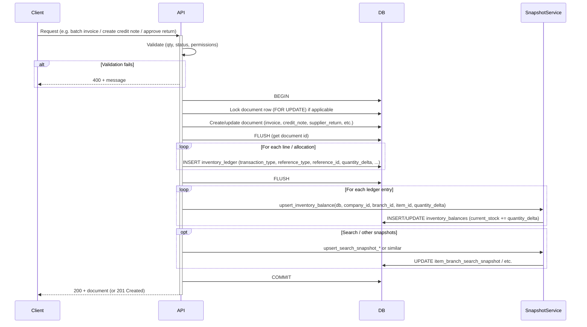

# PharmaSight Unified Transaction Engine — Specification

This document defines the **unified transaction engine** specification based on the findings in `TRANSACTION_ENGINE_AUDIT.md`. It is the single source of truth for movement types, validation rules, workflows, and sequencing. **No code is prescribed here; this is design only.**

---

## 1. Standard Movement Types

The engine supports exactly the following **transaction_type** values on `inventory_ledger`:

| # | Movement Type     | Description |
|---|-------------------|-------------|
| 1 | **SALE**          | Customer sale — stock out from sales invoice batching |
| 2 | **SALE_RETURN**   | Customer return — stock back in from credit note |
| 3 | **PURCHASE**      | Goods receipt — stock in from GRN or supplier invoice |
| 4 | **PURCHASE_RETURN** | Supplier return — stock out (return to supplier) |
| 5 | **ADJUSTMENT**    | Manual, batch correction, or stock take — stock in or out by delta |
| 6 | **TRANSFER_IN**   | Branch receipt — stock in at receiving branch |
| 7 | **TRANSFER_OUT**  | Branch transfer send — stock out at supplying branch |
| 8 | **OPENING_BALANCE** | Opening balance / import — stock in, no source document |

**Implementation note:** The current codebase uses `TRANSFER` with sign for both branch transfer out and branch receipt. The spec standardizes on **TRANSFER_IN** and **TRANSFER_OUT** for clarity; migration or aliasing can map existing data if needed.

---

## 2. Movement Type Specification (Per Type)

For each movement type the following are defined: **quantity_delta sign**, **stock effect**, **COGS behavior**, and **allowed reference_type** (and reference_id where applicable).

---

### 2.1 SALE

| Attribute | Specification |
|-----------|---------------|
| **quantity_delta** | **Negative only.** Magnitude = quantity sold in base units (per batch allocation). |
| **Stock effect** | Decreases `inventory_balances.current_stock` for (item_id, branch_id). |
| **COGS behavior** | **Increases** COGS. `total_cost` on each SALE row is cost of goods sold for that batch slice. Period COGS = sum(ledger.total_cost) for SALE rows in period. |
| **Allowed reference_type** | `sales_invoice` |
| **reference_id** | UUID of `sales_invoices.id`. Required. |
| **Batch** | One ledger row per batch slice consumed (FEFO). batch_number, expiry_date, unit_cost, total_cost required per row. |

---

### 2.2 SALE_RETURN

| Attribute | Specification |
|-----------|---------------|
| **quantity_delta** | **Positive only.** Magnitude = quantity returned in base units (per line/batch). |
| **Stock effect** | Increases `inventory_balances.current_stock` for (item_id, branch_id). |
| **COGS behavior** | **Decreases** COGS (reversal). `total_cost` on each SALE_RETURN row reverses cost of returned quantity. Period COGS = sum(SALE total_cost) − sum(SALE_RETURN total_cost) for period. |
| **Allowed reference_type** | `credit_note` |
| **reference_id** | UUID of `credit_notes.id`. Required. |
| **Batch** | Must match original sale batch (batch_number, expiry_date) and use same unit_cost as original sale for correct COGS reversal. |

---

### 2.3 PURCHASE

| Attribute | Specification |
|-----------|---------------|
| **quantity_delta** | **Positive only.** Magnitude = quantity received in base units (per batch). |
| **Stock effect** | Increases `inventory_balances.current_stock` for (item_id, branch_id). |
| **COGS behavior** | Does **not** affect sales COGS. Records purchase cost (unit_cost, total_cost) for inventory valuation and future COGS when sold. |
| **Allowed reference_type** | `grn` **or** `purchase_invoice` (supplier invoice). |
| **reference_id** | UUID of `grn.id` or `supplier_invoices.id`. Required. |
| **Batch** | batch_number, expiry_date, unit_cost, total_cost per row. One row per batch (or per allocation if multi-batch). |

---

### 2.4 PURCHASE_RETURN

| Attribute | Specification |
|-----------|---------------|
| **quantity_delta** | **Negative only.** Magnitude = quantity returned to supplier in base units. |
| **Stock effect** | Decreases `inventory_balances.current_stock` for (item_id, branch_id). |
| **COGS behavior** | Does not change sales COGS. May be used in supplier ledger / payables to reduce amount owed. |
| **Allowed reference_type** | `supplier_return` |
| **reference_id** | UUID of supplier return document (e.g. `supplier_returns.id`). Required. |
| **Batch** | batch_number, expiry_date, unit_cost, total_cost should match the original purchase batch being returned where applicable. |

---

### 2.5 ADJUSTMENT

| Attribute | Specification |
|-----------|---------------|
| **quantity_delta** | **Positive or negative.** Magnitude = net change in base units. |
| **Stock effect** | Adds quantity_delta to `inventory_balances.current_stock`. Positive = stock in, negative = stock out. |
| **COGS behavior** | No direct COGS impact for sales reporting. total_cost may be set for valuation (e.g. stock take); optional. |
| **Allowed reference_type** | `MANUAL_ADJUSTMENT` \| `BATCH_QUANTITY_CORRECTION` \| `BATCH_METADATA_CORRECTION` \| `STOCK_TAKE` |
| **reference_id** | Optional. Required for `STOCK_TAKE` (session id). Null allowed for MANUAL_ADJUSTMENT, BATCH_* where design uses null. |
| **Batch** | Optional for MANUAL_ADJUSTMENT; required for batch corrections and stock take when batch tracking applies. |

---

### 2.6 TRANSFER_IN

| Attribute | Specification |
|-----------|---------------|
| **quantity_delta** | **Positive only.** Magnitude = quantity received in base units at receiving branch. |
| **Stock effect** | Increases `inventory_balances.current_stock` for (item_id, **receiving_branch_id**). |
| **COGS behavior** | No sales COGS impact. Transfer is inter-branch; cost follows the batch (unit_cost, total_cost) for valuation. |
| **Allowed reference_type** | `branch_receipt` |
| **reference_id** | UUID of `branch_receipts.id`. Required. |
| **Batch** | batch_number, expiry_date, unit_cost, total_cost from transfer lines (mirror of TRANSFER_OUT). |

---

### 2.7 TRANSFER_OUT

| Attribute | Specification |
|-----------|---------------|
| **quantity_delta** | **Negative only.** Magnitude = quantity sent in base units from supplying branch. |
| **Stock effect** | Decreases `inventory_balances.current_stock` for (item_id, **supplying_branch_id**). |
| **COGS behavior** | No sales COGS impact. |
| **Allowed reference_type** | `branch_transfer` |
| **reference_id** | UUID of `branch_transfers.id`. Required. |
| **Batch** | One row per FEFO allocation; batch_number, expiry_date, unit_cost, total_cost. |

---

### 2.8 OPENING_BALANCE

| Attribute | Specification |
|-----------|---------------|
| **quantity_delta** | **Positive only.** Magnitude = opening quantity in base units. |
| **Stock effect** | Increases `inventory_balances.current_stock` for (item_id, branch_id). |
| **COGS behavior** | No COGS impact. Used for initial load / import. |
| **Allowed reference_type** | `OPENING_BALANCE` |
| **reference_id** | Optional (null or same as a batch id if needed). |
| **Batch** | Optional. batch_number, expiry_date, unit_cost may be set for batch-tracked opening stock. |

---

### 2.9 Summary Matrix

| Movement Type     | quantity_delta | Stock effect | COGS (sales)   | reference_type(s)   |
|-------------------|----------------|-------------|----------------|---------------------|
| SALE              | −              | Decrease    | Increase COGS  | sales_invoice       |
| SALE_RETURN       | +              | Increase    | Decrease COGS  | credit_note         |
| PURCHASE          | +              | Increase    | —              | grn, purchase_invoice |
| PURCHASE_RETURN   | −              | Decrease    | —              | supplier_return     |
| ADJUSTMENT        | + or −         | Per delta   | —              | MANUAL_*, BATCH_*, STOCK_TAKE |
| TRANSFER_IN       | +              | Increase    | —              | branch_receipt      |
| TRANSFER_OUT      | −              | Decrease    | —              | branch_transfer     |
| OPENING_BALANCE   | +              | Increase    | —              | OPENING_BALANCE     |

---

## 3. Validation Rules

### 3.1 Return quantity vs sold quantity (customer return)

- **Rule:** For each credit note line that references an original sales invoice line, the **quantity returned** must not exceed the **quantity available to return** for that invoice line.
- **Definition:**
  - **sold_qty** = quantity (in base units) of the original sales_invoice_items row (or sum of quantities if multiple lines can reference the same logical line; typically one line per item per invoice).
  - **already_returned_qty** = sum of `quantity_returned` (in base units) over all **approved/posted** credit_note_items that reference the same `original_sale_item_id` (or same invoice + item).
- **Constraint:**
  ```text
  return_qty ≤ sold_qty − already_returned_qty
  ```
- **Scope:** Per (original_invoice_id, original_sale_item_id) or equivalent. Applied at credit note create/post time.
- **Enforcement:** Application logic before creating SALE_RETURN ledger rows. Reject with 400 if violated.

**Optional:** Enforce at line level and at document level (total returned per invoice ≤ total sold per invoice).

---

### 3.2 Return quantity vs received quantity (supplier return)

- **Rule:** For each supplier return line, the **quantity returned** must not exceed the **quantity available to return** for that item/batch from the linked purchase (or from branch stock if not linked).
- **Definition:**
  - If linked to a supplier invoice: **received_qty** = quantity received for that item (and optionally batch) on that invoice; **already_returned_qty** = sum of quantities already credited for that invoice/item/batch.
  - If not linked: **available** = current stock for (item_id, branch_id) for the batch (or total item stock).
- **Constraint:**
  ```text
  return_qty ≤ received_qty − already_returned_qty   (when linked)
  return_qty ≤ available_stock                       (when not linked or as general cap)
  ```
- **Enforcement:** Application logic at supplier return create/approve. Reject with 400 if violated.

---

### 3.3 Batch integrity

- **Sales (SALE):** For each item line, ledger rows must be created from a **FEFO allocation** only. No ledger row may be created if it would make net stock (per item/branch or per batch) negative. Allocation must use **locked** ledger reads (or equivalent) so concurrent sales cannot over-allocate.
- **Customer return (SALE_RETURN):** Returned batch (batch_number, expiry_date) should match the batch from the original sale where possible. unit_cost must be the **original sale cost** (from invoice line or original SALE ledger) so COGS reversal is correct.
- **Purchases (PURCHASE / PURCHASE_RETURN):** Batch fields (batch_number, expiry_date, unit_cost) must be consistent with the document lines. For PURCHASE_RETURN, quantity returned per batch must not exceed positive balance for that (item_id, branch_id, batch_number, expiry_date).
- **Transfers:** TRANSFER_OUT allocation must use FEFO with lock; TRANSFER_IN rows must mirror the same batches and costs. No transfer row may be created if it would make supplying-branch stock negative.
- **Adjustments:** For batch-tracked adjustments (e.g. STOCK_TAKE, BATCH_QUANTITY_CORRECTION), batch and expiry must be provided where required by policy. Net quantity_delta per (item_id, branch_id) must not make balance negative unless business explicitly allows negative stock (not recommended).

---

### 3.4 Transaction safety

- **Single transaction:** For every operation that creates one or more ledger rows, **all** of the following must occur in the **same** database transaction:
  1. Create/update the **document** (e.g. credit note, supplier return).
  2. Insert all **inventory_ledger** rows for that operation.
  3. Call **SnapshotService.upsert_inventory_balance** for each ledger row (same order or any order; delta must match ledger row).
  4. Any other snapshot or search snapshot updates that are part of the same business operation.
- **Commit or rollback:** The transaction must either **commit** once at the end or **roll back** on any error. No partial commit (e.g. ledger committed but snapshot not).
- **Row-level locking:** For operations that read-and-then-write stock (e.g. batching a sales invoice, completing a transfer, approving a supplier return), the **document** row (invoice, transfer, return) must be locked with `SELECT ... FOR UPDATE` (e.g. `with_for_update()`) before performing allocation and ledger writes, so that:
  - Double-submit (e.g. double batch) is serialized and the second request fails validation (e.g. "already batched").
  - Concurrent allocation (e.g. two transfers for same branch/item) sees consistent ledger state when using FEFO with lock.
- **Idempotency (optional but recommended):** For customer return creation, support an optional idempotency key (e.g. client-generated UUID or idempotency_key column). If the same key is sent again, return the same created credit note and do not create duplicate ledger rows.

---

## 4. Workflows

### 4.1 Customer return (credit note) — exact workflow

**Preconditions:**

- Original document is a **sales invoice** with status **BATCHED** or **PAID**.
- Invoice belongs to the same company and branch as the return.

**Steps:**

1. **User initiates return**  
   User selects the original sales invoice (and optionally specific lines) and indicates quantities to return per line. User provides reason and credit note date.

2. **Validate**  
   - For each line: `quantity_returned ≤ sold_qty − already_returned_qty` (sold_qty and already_returned_qty in same unit, e.g. base units).  
   - Original invoice exists, is BATCHED or PAID, same company/branch.  
   - At least one line with quantity_returned > 0.  
   If any check fails → 400, no DB write.

3. **Begin transaction**  
   Start a single DB transaction. Optionally lock the original invoice row (e.g. FOR UPDATE) if implementing strict concurrency for return-qty checks.

4. **Create document**  
   - Insert **credit_notes**: company_id, branch_id, original_invoice_id, credit_note_no (from DocumentService.get_credit_note_number), credit_note_date, reason, total_exclusive, vat_*, total_inclusive, created_by.  
   - Insert **credit_note_items** for each line: credit_note_id, item_id, original_sale_item_id, quantity_returned (base or sale unit; convert to base for ledger), unit_price_exclusive, batch_number, expiry_date (from original sale), unit_cost (from original sale line or ledger), line totals, etc.  
   - Flush to get credit_note.id.

5. **Create ledger rows (SALE_RETURN)**  
   For each credit_note_item:  
   - quantity_delta = + quantity_returned (in base units).  
   - transaction_type = `SALE_RETURN`.  
   - reference_type = `credit_note`.  
   - reference_id = credit_note.id.  
   - item_id, branch_id, company_id from credit note.  
   - batch_number, expiry_date, unit_cost from original sale (from invoice line or SALE ledger).  
   - total_cost = unit_cost × quantity_returned (base).  
   - created_by = current user.  
   Insert each row; flush.

6. **Update snapshot**  
   For each ledger row:  
   `SnapshotService.upsert_inventory_balance(db, company_id, branch_id, item_id, entry.quantity_delta)`.

7. **Optional search snapshot**  
   If last_sale_date or similar is updated on return, call the corresponding snapshot update (per item/branch). Otherwise skip.

8. **Commit**  
   Commit the transaction.

9. **Post-commit (optional)**  
   Schedule snapshot refresh (e.g. SnapshotRefreshService), send events, or notify reporting. No further ledger or balance writes in this step.

**Result:** Credit note and its items stored; one or more SALE_RETURN ledger rows; inventory_balances increased; COGS for reporting = SALE total_cost − SALE_RETURN total_cost when report includes both.

---

### 4.2 Supplier return — exact workflow

**Preconditions:**

- Supplier return document exists (e.g. **supplier_returns** and **supplier_return_lines**) with status **Pending** or equivalent.
- Lines have item_id, quantity, unit_cost, batch_number, expiry_date.
- Branch and company are set.

**Steps:**

1. **User approves return**  
   User triggers “Approve” (or “Credit”) on the supplier return.

2. **Validate**  
   - For each line: quantity ≤ available to return (from linked invoice or from current stock by batch).  
   - Return status is Pending (or equivalent).  
   If any check fails → 400, no DB write.

3. **Begin transaction**  
   Start a single DB transaction. Lock the supplier return row (e.g. FOR UPDATE).

4. **Create ledger rows (PURCHASE_RETURN)**  
   For each supplier_return_line:  
   - quantity_delta = − quantity (in base units).  
   - transaction_type = `PURCHASE_RETURN`.  
   - reference_type = `supplier_return`.  
   - reference_id = supplier_return.id.  
   - item_id, branch_id, company_id from return.  
   - batch_number, expiry_date, unit_cost from line.  
   - total_cost = unit_cost × quantity (absolute).  
   - created_by = current user.  
   Insert each row; flush.

5. **Update snapshot**  
   For each ledger row:  
   `SnapshotService.upsert_inventory_balance(db, company_id, branch_id, item_id, entry.quantity_delta)`.

6. **Update supplier ledger (financial)**  
   Create supplier ledger entry (credit) for the return amount so payables are reduced. (Existing SupplierLedgerService.create_entry or equivalent.)

7. **Update return status**  
   Set supplier_return.status = e.g. `credited` (or `approved`). Flush.

8. **Commit**  
   Commit the transaction.

9. **Post-commit (optional)**  
   Schedule snapshot refresh, etc.

**Result:** Supplier return marked credited; PURCHASE_RETURN ledger rows created; inventory_balances decreased; supplier ledger credited.

---

## 5. Sequence Diagrams

### 5.1 Document creation → ledger creation → snapshot update (generic)

This diagram shows the **order** of operations inside a single transaction for any document that affects stock (e.g. batch sales invoice, create credit note, approve supplier return, complete transfer).



---

### 5.2 Ledger creation detail (one document, multiple ledger rows)

This diagram shows how one document (e.g. credit note) results in multiple ledger rows and then one snapshot update per row.

```mermaid
sequenceDiagram
    participant API
    participant Ledger
    participant Snapshot

    API->>API: Build document (e.g. CreditNote + CreditNoteItems)
    API->>Ledger: INSERT ledger row 1 (SALE_RETURN, +qty1, batch A, ...)
    API->>Ledger: INSERT ledger row 2 (SALE_RETURN, +qty2, batch B, ...)
    Note over API,Ledger: ... one row per credit_note_item / batch slice
    API->>Ledger: FLUSH

    API->>Snapshot: upsert_inventory_balance(delta = row1.quantity_delta)
    Snapshot->>Snapshot: current_stock += delta1
    API->>Snapshot: upsert_inventory_balance(delta = row2.quantity_delta)
    Snapshot->>Snapshot: current_stock += delta2
    Note over API,Snapshot: All in same transaction; commit once at end
```

---

### 5.3 Snapshot update (inventory_balances)

This diagram shows the contract of the snapshot update: it is **additive** and **sign-agnostic**.

```mermaid
sequenceDiagram
    participant Caller
    participant SnapshotService
    participant inventory_balances

    Caller->>+SnapshotService: upsert_inventory_balance(db, company_id, branch_id, item_id, quantity_delta)
    Note over Caller: quantity_delta from ledger row (e.g. -5 for SALE, +3 for SALE_RETURN)

    SnapshotService->>inventory_balances: INSERT (item_id, branch_id, current_stock = quantity_delta)<br/>OR ON CONFLICT DO UPDATE SET current_stock = current_stock + quantity_delta
    Note over SnapshotService,inventory_balances: Same operation for positive or negative delta

    SnapshotService-->>-Caller: (void)
    Note over Caller: Caller commits transaction later; no partial commit
```

---

### 5.4 Customer return (credit note) — full flow

End-to-end sequence for creating a credit note and posting SALE_RETURN.

```mermaid
sequenceDiagram
    participant User
    participant Frontend
    participant API
    participant DB
    participant SnapshotService

    User->>Frontend: Select invoice, set return qty per line, reason, date
    Frontend->>+API: POST /sales/credit-notes { original_invoice_id, reason, date, items: [{ item_id, quantity_returned, ... }] }

    API->>API: Resolve sold_qty and already_returned_qty per line
    API->>API: Validate return_qty ≤ sold_qty − already_returned_qty
    alt Validation fails
        API-->>Frontend: 400
    end

    API->>DB: BEGIN
    API->>DB: Lock original invoice (optional)
    API->>DB: INSERT credit_notes
    API->>DB: INSERT credit_note_items
    API->>DB: FLUSH

    loop Per credit_note_item
        API->>DB: INSERT inventory_ledger (SALE_RETURN, +qty, reference_type=credit_note, reference_id=credit_note.id)
    end
    API->>DB: FLUSH

    loop Per ledger entry
        API->>SnapshotService: upsert_inventory_balance(quantity_delta)
        SnapshotService->>DB: UPDATE inventory_balances
    end

    API->>DB: COMMIT
    API-->>-Frontend: 201 + CreditNote
    Frontend-->>User: Success; stock and COGS reversed
```

---

### 5.5 Supplier return (approve) — full flow

End-to-end sequence for approving a supplier return and posting PURCHASE_RETURN.

```mermaid
sequenceDiagram
    participant User
    participant Frontend
    participant API
    participant DB
    participant SnapshotService
    participant SupplierLedger

    User->>Frontend: Approve supplier return
    Frontend->>+API: PATCH /suppliers/returns/{id}/approve

    API->>DB: BEGIN
    API->>DB: Lock supplier_return (FOR UPDATE)
    API->>API: Validate status = Pending, qty ≤ available per line

    loop Per return line
        API->>DB: INSERT inventory_ledger (PURCHASE_RETURN, -qty, reference_type=supplier_return, reference_id=return.id)
    end
    API->>DB: FLUSH

    loop Per ledger entry
        API->>SnapshotService: upsert_inventory_balance(quantity_delta)
        SnapshotService->>DB: UPDATE inventory_balances
    end

    API->>SupplierLedger: create_entry(credit = return total)
    SupplierLedger->>DB: INSERT supplier ledger row
    API->>DB: UPDATE supplier_returns SET status = 'credited'
    API->>DB: COMMIT
    API-->>-Frontend: 200 + SupplierReturn
    Frontend-->>User: Return credited; stock reduced
```

---

## 6. Reference: Allowed reference_type by movement type

| transaction_type   | Allowed reference_type   | reference_id required |
|--------------------|---------------------------|------------------------|
| SALE               | sales_invoice             | Yes (sales_invoices.id) |
| SALE_RETURN        | credit_note               | Yes (credit_notes.id)  |
| PURCHASE           | grn, purchase_invoice     | Yes (grn.id or supplier_invoices.id) |
| PURCHASE_RETURN    | supplier_return           | Yes (supplier_returns.id) |
| ADJUSTMENT         | MANUAL_ADJUSTMENT, BATCH_QUANTITY_CORRECTION, BATCH_METADATA_CORRECTION, STOCK_TAKE | For STOCK_TAKE yes (session id); else optional |
| TRANSFER_IN        | branch_receipt            | Yes (branch_receipts.id) |
| TRANSFER_OUT       | branch_transfer           | Yes (branch_transfers.id) |
| OPENING_BALANCE    | OPENING_BALANCE           | Optional |

---

*End of specification. Implementation must follow this spec; any deviation should be documented and aligned with this document.*
